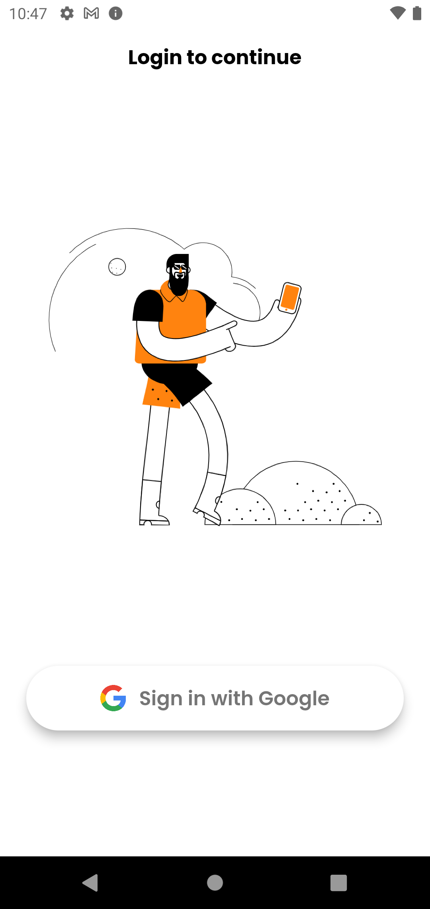
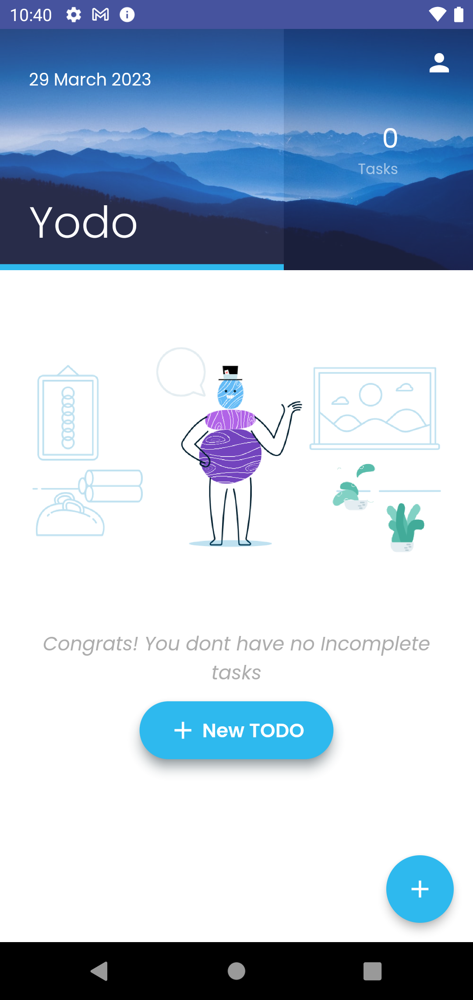
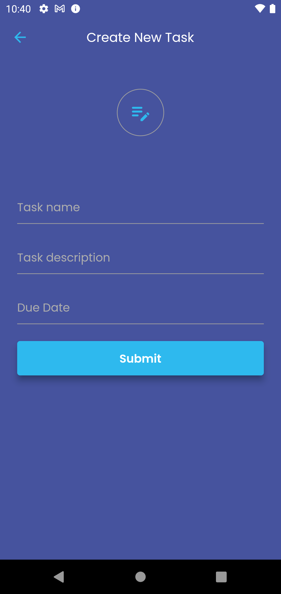
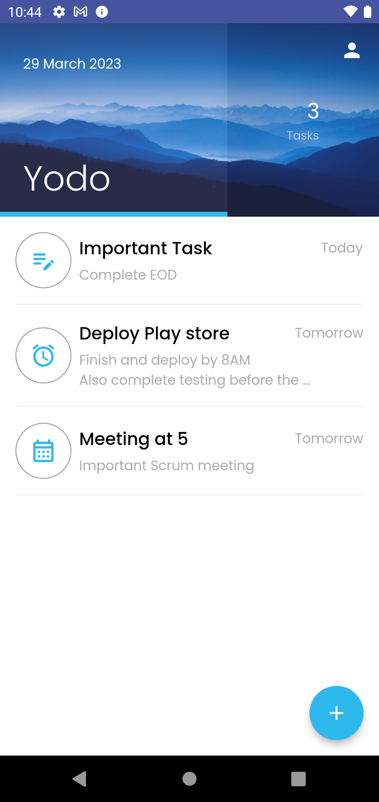
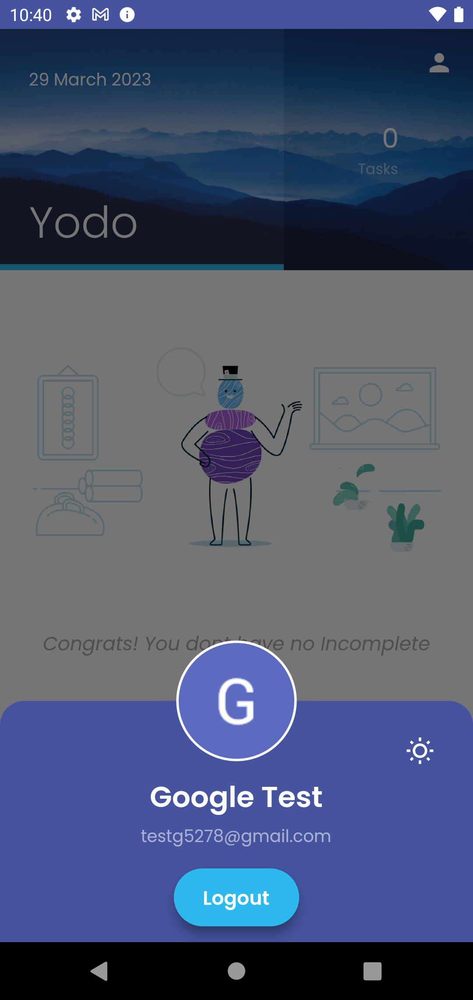
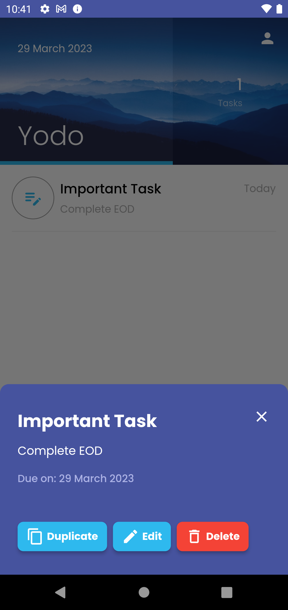
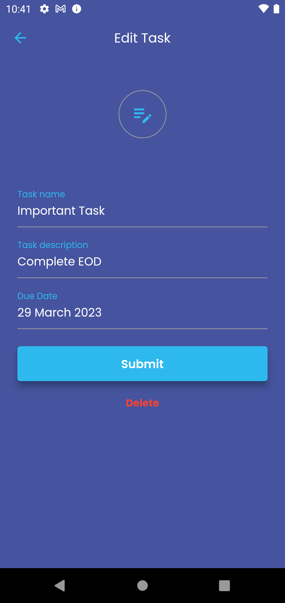
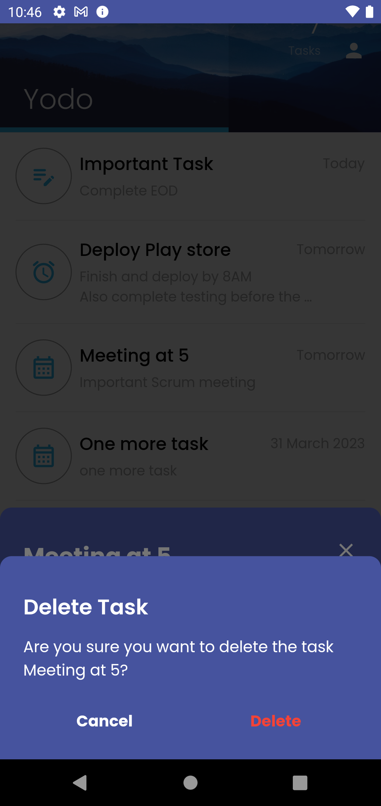

# yodo

A Simple TODO App.

## Getting Started

***

__Configure Firebase configurations file:__

1. Login in to Firebase console and create a project
2. Add the android and iOS packages to the firebase project. Alternatively you can setup the porject using Firebase CLI which is pretty _recommended way_.
3. If the project is added package wise, then add the google-services config file to ios and android.

__Run the App:__

Run `flutter pub get` to install dependencies

Run `flutter run` to run the app in a mobile device

***

## Tech stack

 
 
***

## Screenshots

 |  | 
:----:|:----:|:----:
 |  | 
:----:|:----:|:----:
 |  | 
